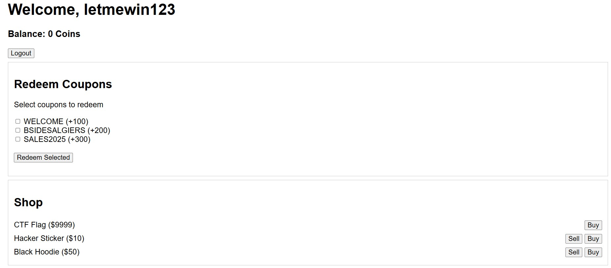

# Expensive_Shop
CTF: Bsides Algiers 2025  
Link: https://github.com/Shellmates/BSides-Algiers-2025-challenges/tree/main/web/Expensive_Shop

## Write-up

This scenario is a classic flag shop challenge. Players can register and log in, with a starting balance of 0.



Here we have a feature to redeem coupons, sell and buy items. We need to buy the flag item to get the actual flag.

The source code is provided with the challenge. After reading the code we see this interesting part:
```javascript
app.post('/redeem', async (req, res) => {
    if (!req.user) return res.status(403).json({ error: 'Not authorized' });

    let coupons = req.body.coupons;
    
    if (!Array.isArray(coupons)) {
        coupons = [coupons];
    }

    coupons.forEach(async (couponCode) => {
        if (COUPONS[couponCode]) {
            const redeemed = await db.get(
                'SELECT * FROM redemptions WHERE user_id = ? AND coupon_code = ?', 
                [req.user.id, couponCode]
            );
            if (!redeemed) {
                req.user.balance += COUPONS[couponCode];
                try {
                    await db.run('INSERT INTO redemptions (user_id, coupon_code) VALUES (?, ?)', [req.user.id, couponCode]);
                    await updateUserInDb(req.user); 
                } catch (err) {
                }
            }
        }
    });

    res.json({ success: true, message: 'Coupon Redeemed Sucessfully' });
});
```
This function is responsible for the coupon redeeming feature, it is supposed to take an array of coupons, loop through each coupon, check if the coupon is already redeemed, and if not, the coupon value is added to the balance and it is marked as redeemed.

The issue here is that forEach in JS is not suitable for asynchronous programming, The `Array.prototype.forEach` method is synchronous. It doesn't understand async/await. If you put an await inside a forEach callback, the loop won't wait for it to finish before moving to the next iteration.

The trick is to send an array containing multiple coupons of the same name. The function here will loop through all user provided coupons and add the balance, because all iterations reach the redeem check nearly at the same time, the `redeemed` will be false for all iterations.

The solve script can be found [here](exploit.py)

## Flag

`shellmates{e4sy_RacE_F0rE4cH_1S_Not_For_asYNChrOUNoUs_PrOGrAMMing}`
